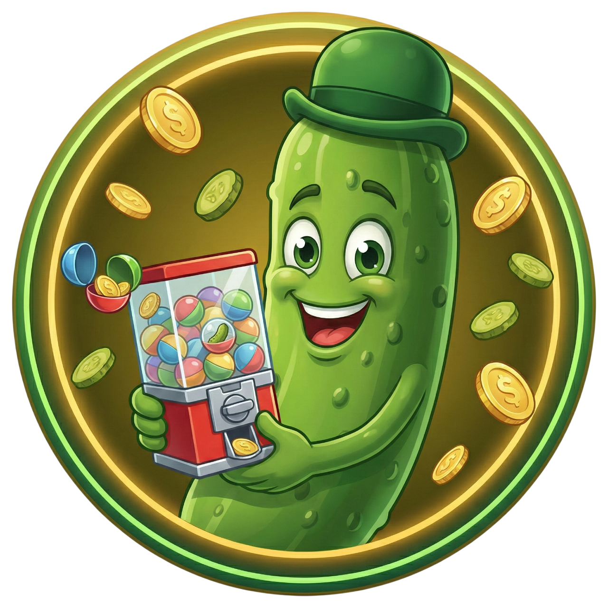
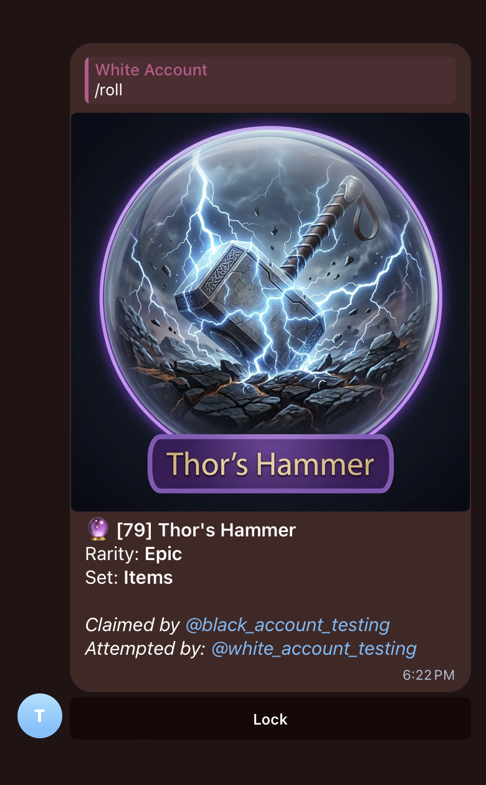
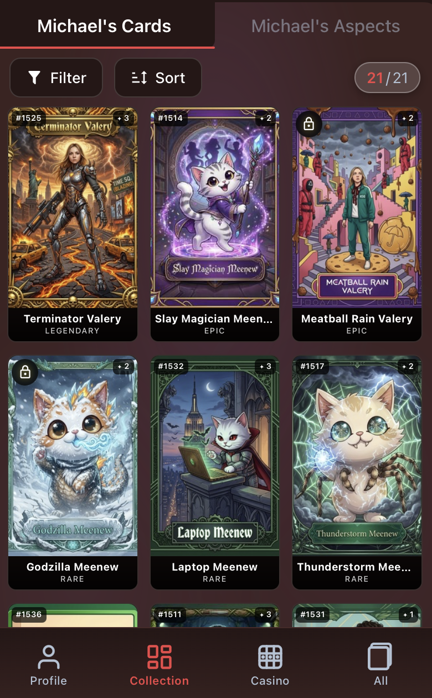
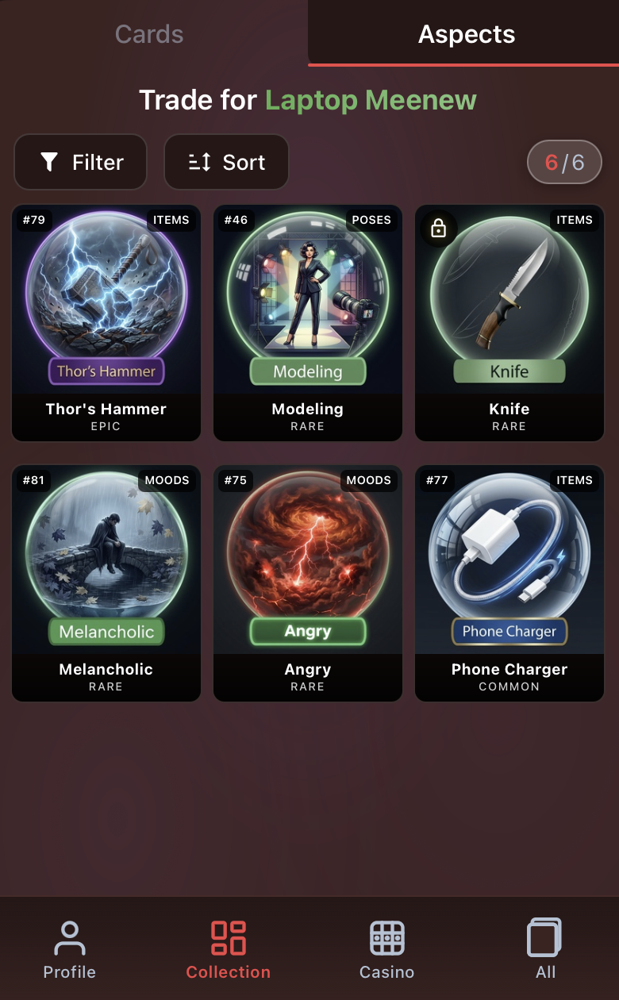
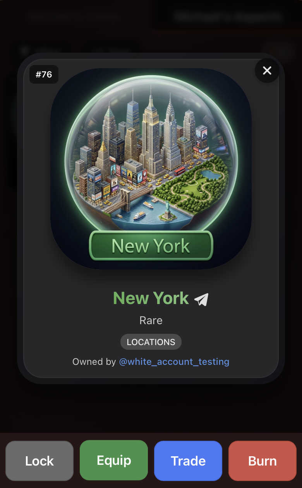
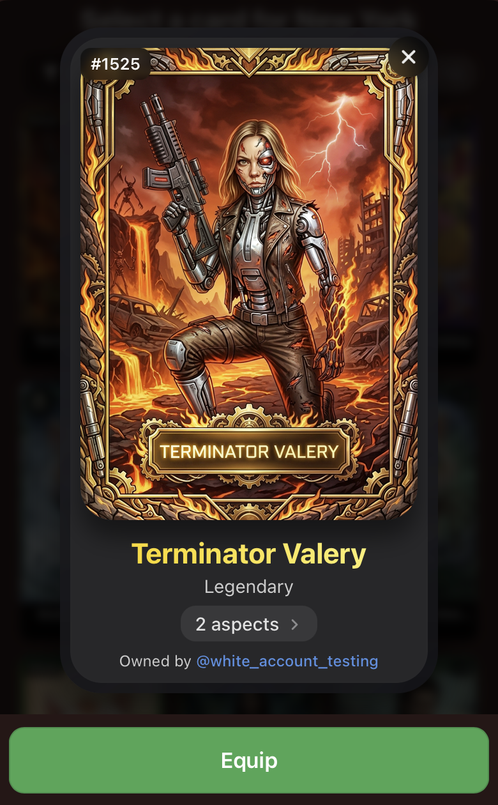
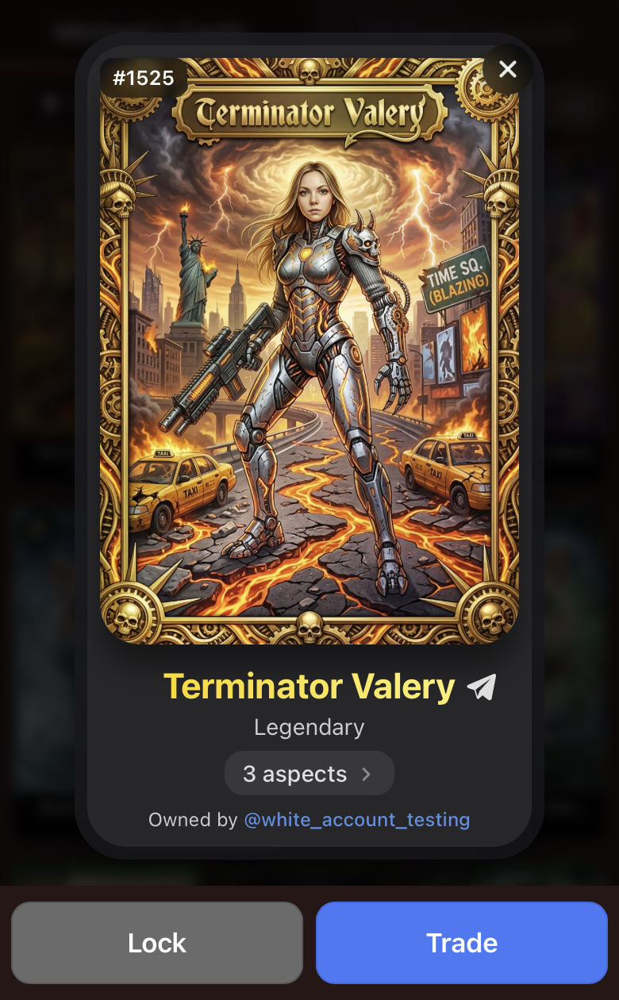
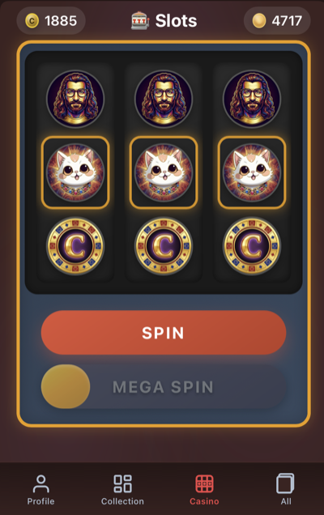
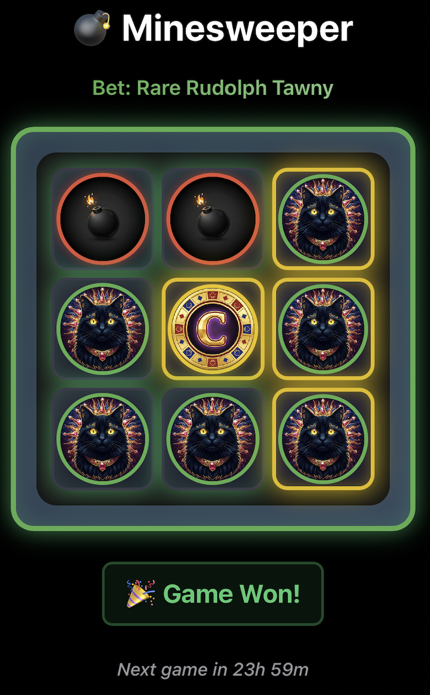
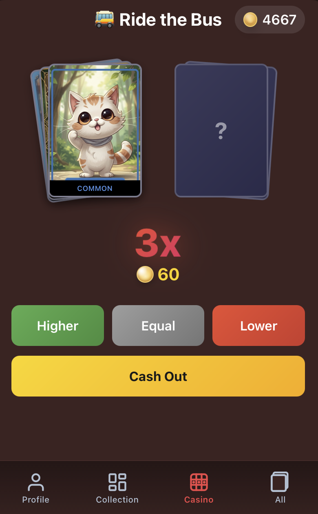

<p align="center">
  
</p>

<h1 align="center">Crunchy Gherkins TCG</h1>

<p align="center">
  A Telegram-based trading card game where you collect AI-generated cards<br/>
  featuring you and your friends — then craft, trade, and gamble your way to the top.
</p>

<p align="center">
  <a href="https://t.me/CrunchyGherkinsGachaBot"></a>
  
  
  
</p>

---

## Gameplay

### 🃏 Collect

Roll, claim, browse, and trade AI-generated cards and aspects.

- **Roll** — `/roll` once per 24 hours to generate a **base character card** (10%) or an **aspect** (90%), with art by Google Gemini
- **Claim** — rolled items appear in chat; any enrolled player can claim them using claim points
- **Browse** — view your collection in the Telegram Mini App with filters, sorting, and detail views
- **Trade** — swap any item for any item: card↔card, aspect↔aspect, or cross-type via `/trade` or the Mini App

<div align="center">
<table>
  <tr>
    <td align="center"></td>
    <td align="center"></td>
    <td align="center"></td>
  </tr>
  <tr>
    <td align="center"><sub>Roll & claim in chat</sub></td>
    <td align="center"><sub>Browse collection</sub></td>
    <td align="center"><sub>Trade with friends</sub></td>
  </tr>
</table>
</div>

### 🔧 Craft

Equip aspects onto base cards to create unique combinations with new AI-generated art.

- **Equip** — `/equip` up to 5 aspects onto a card, choose a name, and generate new art blending the character with equipped aspects
- **Recycle** — combine lower-rarity aspects into higher ones (3 Common→Rare, 3 Rare→Epic, 4 Epic→Legendary)
- **Create** — forge a **Unique** aspect by sacrificing 5 Legendaries and choosing a custom name

<div align="center">
<table>
  <tr>
    <td align="center"></td>
    <td align="center"></td>
    <td align="center"></td>
  </tr>
  <tr>
    <td align="center"><sub>Choose aspect to equip</sub></td>
    <td align="center"><sub>Choose card to equip</sub></td>
    <td align="center"><sub>Equip result</sub></td>
  </tr>
</table>
</div>

### 🎰 Play

Spend spins on casino mini-games. Earn spins by burning aspects or through daily login bonuses.

- **Slots** — spin 3 reels to win cards, aspects, or claim points; megaspin every ~100 spins
- **Minesweeper** — bet a card, reveal tiles on a 3×3 grid without hitting mines to win an aspect
- **Ride the Bus** — bet spins, guess card rarities through escalating multipliers (2x→3x→5x→10x), cash out anytime

<div align="center">
<table>
  <tr>
    <td align="center"></td>
    <td align="center"></td>
    <td align="center"></td>
  </tr>
  <tr>
    <td align="center"><sub>Slots</sub></td>
    <td align="center"><sub>Minesweeper</sub></td>
    <td align="center"><sub>Ride the Bus</sub></td>
  </tr>
</table>
</div>

---

## Architecture

### Stack

| Layer | Technology |
|-------|-----------|
| **Bot** | Python · `python-telegram-bot` |
| **API** | FastAPI (powers the Mini App) |
| **Frontend** | React · Vite · TypeScript (Telegram Mini App) |
| **Database** | PostgreSQL · SQLAlchemy · Alembic |
| **AI Art** | Google Gemini API |
| **Deploy** | Docker Compose · GCP Compute Engine |

### Data Flow

```
Telegram Chat              Mini App (WebView)         Admin Dashboard
     │                            │                         │
     ▼                            ▼                         ▼
Bot Handlers ──────────►  FastAPI Endpoints  ◄───── Admin Routers
     │                            │                         │
     └────────►  Manager Layer  ◄─┘─────────────────────────┘
               (business logic)
                      │
                      ▼
              Repository Layer
               (data access)
                      │
                      ▼
             PostgreSQL Database
```

**Layer rules:**
- **Handlers / Routers** — thin entry points, delegate to managers
- **Managers** — business logic, validation, game rules
- **Repositories** — pure data access, return Pydantic DTOs

### Project Structure

```
├── bot/                      # Backend (Python)
│   ├── bot.py                #   Telegram bot entry point
│   ├── api/                  #   FastAPI server + routers
│   ├── handlers/             #   Telegram command handlers
│   ├── managers/             #   Business logic layer
│   ├── repos/                #   Data access layer
│   ├── utils/                #   Models, schemas, helpers
│   ├── prompts/              #   Gemini prompt templates (.md)
│   ├── settings/             #   Config loader + constants
│   ├── alembic/              #   DB migrations
│   └── config.json           #   Tunable game constants
├── miniapp/                  # Frontend (React + TypeScript)
│   └── src/
│       ├── pages/            #   Landing, Hub, SingleCard, Admin
│       ├── components/       #   Cards, aspects, casino, tabs
│       ├── hooks/            #   ~23 custom hooks
│       ├── services/         #   API client (ApiService)
│       └── stores/           #   Zustand state
├── docker-compose.yml        # Container orchestration
└── deploy.sh                 # One-command GCP deployment
```

---

## Getting Started

### Prerequisites

- Python 3.11+
- Node.js 18+
- PostgreSQL 15+
- A Telegram Bot token (from [@BotFather](https://t.me/BotFather))
- A Google Gemini API key

### Local Development

```bash
# 1. Clone the repo
git clone https://github.com/YOUR_USERNAME/CrunchyGherkinsGachaBot.git
cd CrunchyGherkinsGachaBot

# 2. Backend setup
cd bot
cp .env.example .env          # Fill in tokens, keys, DB URL
pip install -r requirements.txt
python bot.py --debug          # Runs with test bot token + api.telegram.org

# 3. API server (separate terminal)
uvicorn bot.api.server:app --reload

# 4. Mini App (separate terminal)
cd miniapp
npm install
npm run dev                    # http://localhost:5173
```

### Docker

```bash
# Copy env template
cp .env.example .env           # Fill in all values

# Build and run locally
docker compose up --build

# Production (with Cloud SQL proxy)
docker compose --profile prod up -d --build

# Deploy to GCP VM
./deploy.sh
```

### Environment Variables

See [`.env.example`](.env.example) for the full list. Key variables:

| Variable | Description |
|----------|-------------|
| `DATABASE_URL` | PostgreSQL connection string |
| `TELEGRAM_AUTH_TOKEN` | Production bot token |
| `GOOGLE_API_KEY` | Gemini API key |
| `IMAGE_GEN_MODEL` | Gemini model name |
| `BOT_ADMIN` | Admin Telegram username |
| `CURRENT_SEASON` | Active season ID |

---

## Infrastructure

### Docker Services

| Service | Image | Purpose |
|---------|-------|---------|
| `bot` | Custom (shared) | Telegram bot polling |
| `api` | Custom (shared) | FastAPI server |
| `frontend` | Nginx + SPA | Mini App + `/api/` proxy |
| `tg-bot-api` | `aiogram/telegram-bot-api` | Local Telegram Bot API server |
| `cloud-sql-proxy` | Google Cloud SQL | Production DB proxy (profile: `prod`) |

### Database

- **Fresh DB**: auto-detected → applies `schema_baseline.sql` + stamps Alembic at head
- **Existing DB**: incremental Alembic migrations on startup
- **New migration**: edit `bot/utils/models.py`, then `cd bot && alembic revision -m "description"`

---

## Bot Commands

| Command | Description |
|---------|-------------|
| `/start` | Register with the bot |
| `/profile <name>` + photo | Set display name and photo |
| `/enroll` | Join the current group chat |
| `/roll` | Roll for a card or aspect (24h cooldown) |
| `/equip` | Equip aspects onto a card |
| `/refresh` | Regenerate a card's art |
| `/burn` | Burn an aspect for spins |
| `/recycle` | Combine lower-rarity items into higher |
| `/create` | Forge a Unique aspect (costs 5 Legendaries) |
| `/trade <type> <id> <type> <id>` | Trade cards or aspects |
| `/lock <id>` | Lock/unlock a card or aspect |
| `/casino` | View spin balance / open casino |
| `/balance` | View claim points |
| `/collection` | Browse your collection |
| `/stats` | View your statistics |
| `/notify` | Toggle roll reminder DMs |
| `/help` | Show command reference |

---